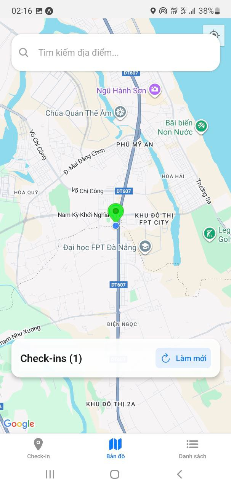
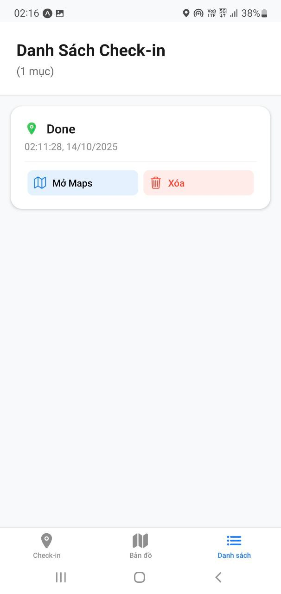

# 🌍 Geo-Checkin App (React Native + Expo)

**Geo-Checkin** là ứng dụng React Native cơ bản được xây dựng bằng **Expo CLI**, cho phép người dùng **check-in vị trí hiện tại (GPS)** và hiển thị **toàn bộ check-in trên bản đồ**.

Ứng dụng sử dụng các API và package phổ biến:
- 🗺️ `react-native-maps`
- 📍 `expo-location`
- 💾 `@react-native-async-storage/async-storage`

---

## 🚀 Mục tiêu bài tập

> Xây dựng ứng dụng di động có chức năng **check-in vị trí hiện tại** bằng GPS, hiển thị danh sách các điểm đã check-in và đánh dấu (marker) trên bản đồ.

---

## 🧩 Tính năng chính

| Tính năng | Mô tả |
|------------|-------|
| 📍 **Check-in vị trí hiện tại** | Lấy toạ độ GPS bằng `expo-location`, lưu lại với thời gian và ghi chú |
| 💾 **Lưu trữ cục bộ** | Dùng `AsyncStorage` để lưu danh sách các lần check-in (offline support) |
| 🗺️ **Bản đồ trực quan** | Hiển thị các marker tương ứng trên bản đồ (Google Maps / Apple Maps) |
| 📋 **Danh sách Check-in** | Hiển thị danh sách các lần check-in (FlatList) |
| 🔗 **Mở Google Maps / Apple Maps** | Khi nhấn vào marker, mở điều hướng đến vị trí đó |

---

## 🛠️ Cài đặt & Chạy thử

### 1️⃣ Tạo dự án
```bash
npx create-expo-app geo-checkin
cd geo-checkin

Cài đặt dependencies
npm install @react-native-async-storage/async-storage react-native-maps
npx expo install expo-location

npx expo start
Mở app trong Expo Go (Android/iOS)
Quét QR Code hoặc chạy trên emulator/simulator.

├── app/
│   ├── _layout.tsx              # Root Stack
│   └── (tabs)/
│       ├── _layout.tsx          # Tab Navigator
│       ├── index.tsx            # Check-in screen
│       ├── map.tsx              # Map screen
│       ├── list.tsx             # List screen
│       ├── modal.tsx            # Modal screen (optional)
│       └── +not-found.tsx       # 404 handler
├── utils/
│   └── TS storage.ts            # AsyncStorage helpers
└── app.json                     # Expo config (với Google Maps key)


## Hướng Dẫn Setup Và Chạy
### Yêu Cầu Hệ Thống
- Node.js 20+ LTS
- Expo CLI: `npm install -g @expo/cli`
- Expo Go app trên iOS/Android (test device thật cho GPS/maps)

### Cài Đặt
 Tạo dự án:
   ```bash
   npx create-expo-app@latest GeoCheckinApp --template tabs@54
   cd GeoCheckinApp

npx expo install expo-location react-native-maps @react-native-async-storage/async-storage expo-haptics @expo/vector-icons react-native-gesture-handler react-native-safe-area-context expo-router

npx expo start --clear




